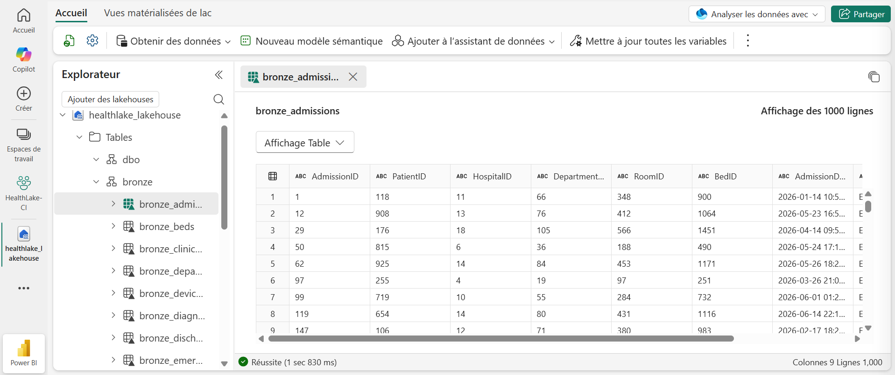
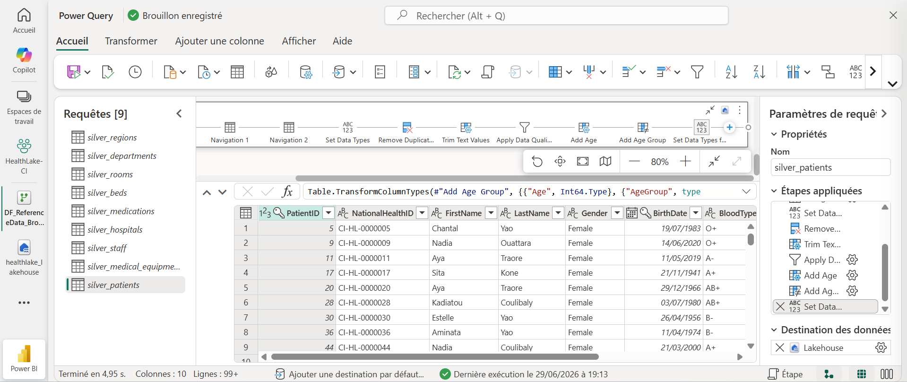

# 🇨🇮 HealthLake CI

## National Healthcare Intelligence Platform

A production-inspired Microsoft Fabric solution for real-time healthcare analytics, governance, and business intelligence.

## 🟤 Bronze Layer — Raw Data Storage

The Bronze layer stores raw healthcare datasets exactly as they were ingested from the source files.

No transformation is applied at this stage. The objective is to preserve source data for traceability, auditing, and future reprocessing.

### Bronze Tables

- Reference data
- Clinical data
- Monitoring data

📸 **Bronze Lakehouse Tables**

## 🔄 Dataflow Gen2 — Bronze to Silver

Dataflow Gen2 transforms raw Bronze datasets into trusted Silver tables by applying data quality rules, standardizing business entities, and enriching operational healthcare data with reusable business attributes.

The first Dataflow focuses on **Master Data**, preparing reference datasets shared across the Lakehouse, Warehouse, Semantic Model, and Power BI reports.

### Key Transformations

- Data type validation
- Duplicate removal
- Text standardization
- Data quality rules
- Business attribute enrichment

### Business Attributes Created

| Table | Attributes |
|--------|------------|
| Patients | `Age`, `AgeGroup` |
| Staff | `YearsOfService` |
| Hospitals | `CapacityCategory` |
| Medical Equipment | `IsOperational` |

📸 **Reference Data Dataflow**

